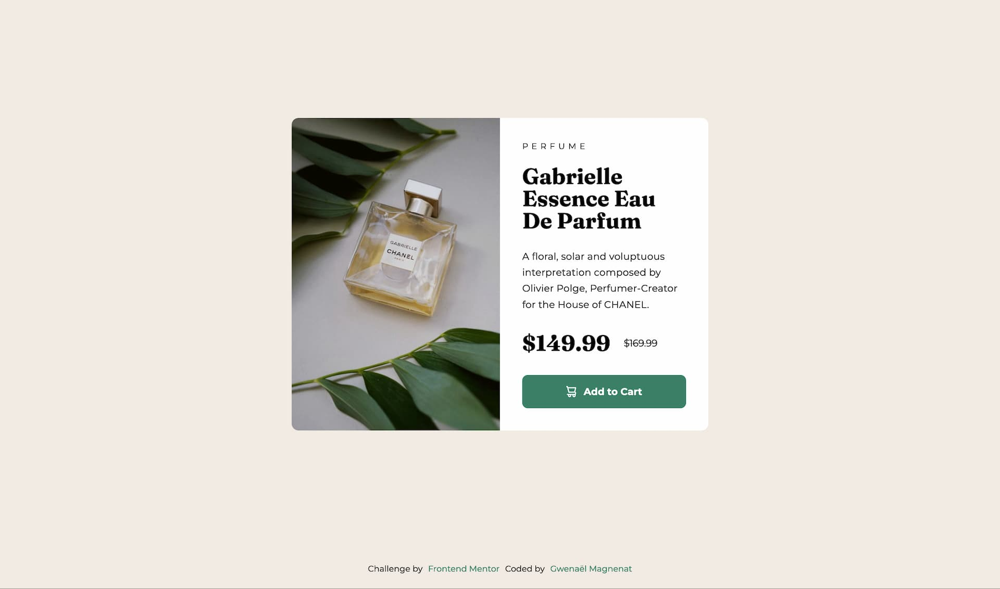

# Frontend Mentor - Social links profile solution

This is a solution to the [Product preview card component challenge on Frontend Mentor](https://www.frontendmentor.io/challenges/product-preview-card-component-GO7UmttRfa). Frontend Mentor challenges help you improve your coding skills by building realistic projects.

## Table of contents

- [Overview](#overview)
  - [The challenge](#the-challenge)
  - [Screenshot](#screenshot)
  - [Links](#links)
- [My process](#my-process)
  - [Built with](#built-with)
  - [What I learned](#what-i-learned)
  - [Continued development](#continued-development)
  - [Useful resources](#useful-resources)
- [Author](#author)

## Overview

### The challenge

Users should be able to:

- View the optimal layout depending on their device's screen size
- See hover and focus states for interactive elements

### Screenshot

### Links

- Solution URL: [Add solution URL here](https://your-solution-url.com)
- Live Site URL: [Add live site URL here](https://your-live-site-url.com)

## My process

### Built with

- Semantic HTML5 markup
- SCSS
- BEM
- Flexbox
- Mobile-first workflow

### What I learned

I learned how to implement the picture element with different sources. It allows me to display different images for different viewport.

### Continued development

Use more mixins and function to create reusable and flexible tools.
**ideas** : for buttons, for image color manibulation, for card component, for grid layout

### Useful resources

- [The picture element](https://developer.mozilla.org/en-US/docs/Web/HTML/Element/picture) - This helped me understand the picture html tag
- [Responsive image](https://developer.mozilla.org/en-US/docs/Learn/HTML/Multimedia_and_embedding/Responsive_images) - This helped me understand how to use art direction with the picture element and serve different images at different viewport width.
- [Font sizes best practices ](https://fedmentor.dev/posts/font-size-px/) - This helped me understand more how to properly uses sizes for accessibility
- [sass:color](https://sass-lang.com/documentation/modules/color/) - I used this ressource to write my button mixin and the hover color

## Author

- Website - [Gwenaël Magnenat](https://gmagnenat.com)
- Frontend Mentor - [@gmagnenat](https://www.frontendmentor.io/profile/gmagnenat)
- LinkedIn - [@gmagnenat](https://www.linkedin.com/in/gmagnenat)
